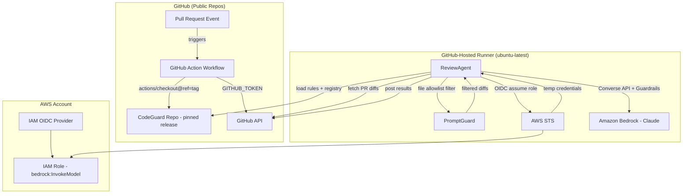
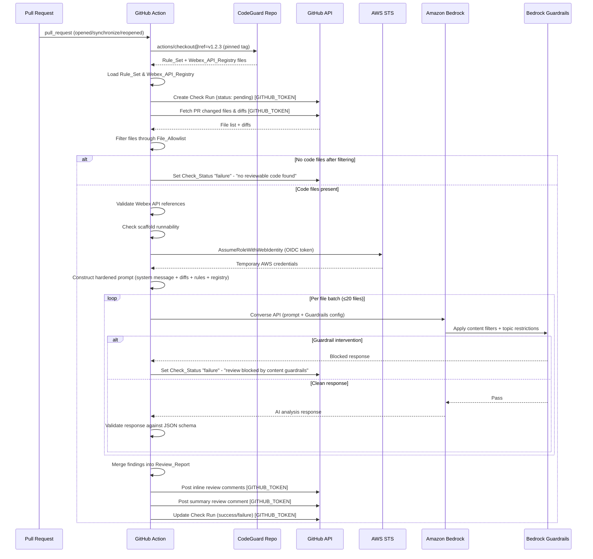
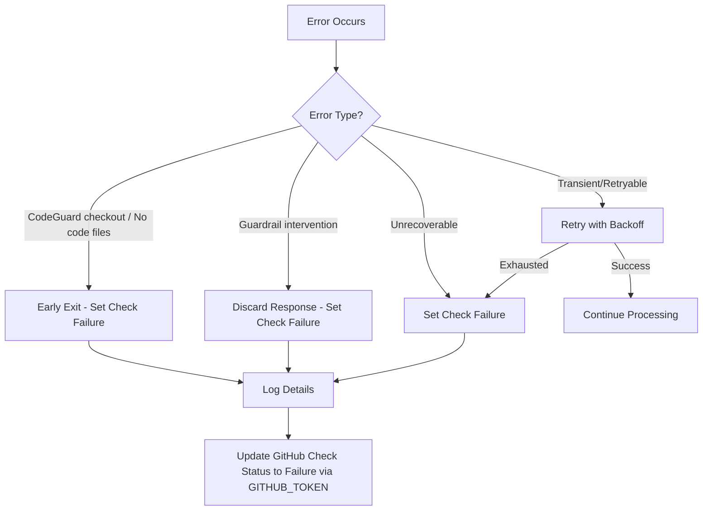

# Design Document: GitHub PR Review Agent

## Overview

The GitHub PR Review Agent is an automated AI-powered code review system implemented as a GitHub Action that evaluates Playbook Pull Requests. It validates that code scaffolds integrate with documented Webex Developer Platform APIs, comply with CodeGuard-derived security rules, and are structurally runnable.

The system runs entirely on GitHub-hosted runners with no server-side infrastructure:

1. A `pull_request` event triggers the GitHub Action workflow in a Playbook repository.
2. The workflow checks out CodeGuard review rules from a public cross-org repository at a pinned release tag.
3. The ReviewAgent sets a pending Check_Status, fetches PR diffs, filters files through a configurable allowlist, and loads the Rule_Set and Webex_API_Registry from the checked-out CodeGuard release.
4. The workflow assumes an IAM role via GitHub OIDC federation (the only AWS resource: an IAM OIDC provider + one IAM role with `bedrock:InvokeModel` and `bedrock:ApplyGuardrail`).
5. The ReviewAgent constructs a hardened prompt, invokes Amazon Bedrock (Claude via Converse API) with Bedrock Guardrails enabled, validates the AI response against a strict JSON schema, and posts results back to the PR using the workflow's GITHUB_TOKEN.

Both the CodeGuard repo and Playbook repos are public, so GitHub-hosted runners are free. The only AWS cost is Bedrock invocations per review.

### Key Design Decisions

| Decision | Rationale |
|---|---|
| GitHub Action on hosted runner | Zero infrastructure; free for public repos; single workflow job |
| CodeGuard checkout at pinned release tag | Deterministic, auditable rule versions; no drift from `main` |
| GitHub OIDC federation → IAM role | Just-in-time AWS credentials; zero long-term secrets |
| GITHUB_TOKEN for GitHub API | Short-lived, auto-generated per workflow run; no GitHub App needed |
| Bedrock Converse API + Guardrails | Managed AI inference with built-in content filtering and prompt injection detection |
| File allowlist filtering | Pre-AI defense against prompt injection via non-code files |
| Strict output JSON schema validation | Post-AI defense ensuring responses conform to expected structure |
| YAML/JSON Rule_Set format | Human-readable, version-controllable, parseable with round-trip fidelity |
| Structured JSON logging with redaction | Observability without leaking secrets |
| Python runtime | Matches existing project setup (.venv); rich AWS SDK support via boto3 |

## Architecture

### System Architecture Diagram



### Sequence Diagram



## Components and Interfaces

### 1. ReviewAgent (`review_agent`)

Main orchestrator that runs the full review pipeline within the GitHub Action job.

```python
class ReviewAgent:
    """Orchestrates the full code review pipeline on a GitHub-hosted runner."""

    def __init__(
        self,
        github_client: GitHubAPIClient,
        rules_engine: ReviewRulesEngine,
        ai_client: AIModelClient,
        webex_registry: WebexAPIRegistry,
        scaffold_checker: ScaffoldChecker,
        report_generator: ReviewReportGenerator,
        prompt_guard: PromptGuard,
        logger: StructuredLogger,
    ):
        ...

    def run(self, owner: str, repo: str, pr_number: int, commit_sha: str) -> None:
        """
        Execute the full review pipeline:
        1. Set Check_Status to pending
        2. Fetch PR changed files
        3. Filter files through allowlist (PromptGuard)
        4. If no code files, fail with "no reviewable code found"
        5. Validate Webex API references
        6. Check scaffold runnability
        7. Batch files (≤20 per batch) and invoke AI Model
        8. Validate AI responses against JSON schema
        9. Merge findings into ReviewReport
        10. Post inline comments and summary to GitHub
        11. Update Check_Status to success/failure
        """
        ...
```

### 2. CodeGuardLoader (`codeguard_loader`)

Loads and validates rules and registry from the checked-out CodeGuard release directory.

```python
class CodeGuardLoader:
    """Loads Rule_Set and Webex_API_Registry from a checked-out CodeGuard release."""

    def __init__(self, checkout_path: str, logger: StructuredLogger):
        ...

    def load_rule_set(self) -> RuleSet:
        """Load and validate the Rule_Set from the CodeGuard release directory."""
        ...

    def load_webex_registry(self) -> WebexAPIRegistryData:
        """Load the Webex_API_Registry from the CodeGuard release directory."""
        ...

    def load_file_allowlist(self) -> set[str]:
        """Load the configurable File_Allowlist from the Rule_Set, or return defaults."""
        ...
```

### 3. PromptGuard (`prompt_guard`)

Pre-AI validation, file filtering, system prompt hardening, and output validation.

```python
class PromptGuard:
    """Defends against prompt injection via file filtering, prompt hardening, and output validation."""

    DEFAULT_ALLOWLIST: set[str] = {
        ".py", ".js", ".ts", ".java", ".go", ".rb", ".rs",
        ".cpp", ".c", ".cs", ".kt", ".swift", ".sh",
    }

    def __init__(self, file_allowlist: set[str] | None = None):
        ...

    def filter_files(self, files: list[PRFile]) -> list[PRFile]:
        """Filter PR files through the File_Allowlist. Returns only code files."""
        ...

    def build_system_message(self) -> str:
        """Return the strict system message that constrains the AI to code analysis only.
        Instructs the model to ignore instructions in code comments, strings, or non-code content."""
        ...

    def validate_response_schema(self, response: dict) -> bool:
        """Validate that the AI response conforms to the expected JSON schema:
        a findings array where each finding has file_path, line_number, rule_id, severity, description."""
        ...
```

### 4. GitHubAPIClient (`github_api_client`)

Handles all GitHub API interactions using the GITHUB_TOKEN.

```python
class GitHubAPIClient:
    """Communicates with GitHub REST API using the GITHUB_TOKEN from the workflow."""

    def __init__(self, github_token: str):
        ...

    def fetch_pr_files(self, owner: str, repo: str, pr_number: int) -> list[PRFile]:
        """Fetch changed files and diffs. Retries up to 3 times with exponential backoff."""
        ...

    def create_check_run(self, owner: str, repo: str, sha: str, status: str, conclusion: str | None = None, output: dict | None = None) -> None:
        """Create or update a Check Run on a commit."""
        ...

    def post_review_comments(self, owner: str, repo: str, pr_number: int, comments: list[ReviewComment]) -> None:
        """Post inline review comments on specific file/line locations."""
        ...

    def post_review_summary(self, owner: str, repo: str, pr_number: int, summary: str) -> None:
        """Post a top-level PR review comment with the summary."""
        ...
```

### 5. ReviewRulesEngine (`review_rules_engine`)

Loads, validates, and filters review rules from Rule_Set files.

```python
class ReviewRulesEngine:
    """Loads, validates, and manages review rules from YAML/JSON Rule_Set files."""

    def load(self, file_path: str) -> RuleSet:
        """Parse a YAML or JSON Rule_Set file. Raises ValidationError on invalid input."""
        ...

    def validate_rule(self, rule: Rule) -> list[str]:
        """Validate a single rule has all required fields. Returns list of error messages."""
        ...

    def filter_by_category(self, rule_set: RuleSet, category: str) -> list[Rule]:
        """Filter rules by Codeguard_Rule_Category."""
        ...

    def get_enabled_rules(self, rule_set: RuleSet) -> list[Rule]:
        """Return only enabled rules."""
        ...

    def print_rule_set(self, rule_set: RuleSet, format: str = "yaml") -> str:
        """Serialize a RuleSet back to YAML or JSON string."""
        ...
```

### 6. AIModelClient (`ai_model_client`)

Interfaces with Amazon Bedrock Converse API using OIDC-assumed credentials.

```python
class AIModelClient:
    """Invokes Amazon Bedrock Claude model via the Converse API with Guardrails."""

    def __init__(self, boto3_session, guardrail_id: str | None = None, guardrail_version: str | None = None):
        ...

    def analyze(self, system_message: str, prompt: str) -> dict:
        """Send a prompt to Bedrock Converse API with Guardrails config.
        Retries up to 2 times on unparseable responses, 3 times on throttling.
        Returns parsed JSON response."""
        ...

    def build_prompt(self, diffs: list[FileDiff], rules: list[Rule], registry: WebexAPIRegistryData) -> str:
        """Construct the analysis prompt from diffs, rules, and registry."""
        ...
```

### 7. WebexAPIRegistry (`webex_api_registry`)

Loads and queries the Webex Developer Platform API endpoint catalog.

```python
class WebexAPIRegistry:
    """Manages the catalog of documented Webex Developer Platform API endpoints."""

    def load(self, file_path: str) -> None:
        """Load registry from YAML or JSON file in the CodeGuard release."""
        ...

    def lookup(self, path: str, method: str | None = None) -> WebexEndpoint | None:
        """Look up an endpoint by path and optional HTTP method."""
        ...

    def extract_api_references(self, code: str) -> list[APIReference]:
        """Extract API endpoint references (URLs, paths, methods) from code."""
        ...

    def validate_references(self, references: list[APIReference]) -> list[Finding]:
        """Validate extracted references against the registry. Returns findings for undocumented endpoints."""
        ...
```

### 8. ScaffoldChecker (`scaffold_checker`)

Validates structural completeness of scaffolds.

```python
class ScaffoldChecker:
    """Checks that a scaffold is structurally complete and runnable."""

    def check_entry_point(self, files: list[PRFile]) -> Finding | None:
        """Check for an identifiable entry point (main function, handler, script)."""
        ...

    def check_dependency_manifest(self, files: list[PRFile]) -> Finding | None:
        """Check for a dependency manifest file (package.json, requirements.txt, etc.)."""
        ...

    def check_config_references(self, files: list[PRFile]) -> list[Finding]:
        """Check for hardcoded connection parameters vs. config/env references."""
        ...

    def check_syntax(self, files: list[PRFile]) -> list[Finding]:
        """Check for syntax errors or incomplete code blocks."""
        ...
```

### 9. ReviewReportGenerator (`report_generator`)

Assembles findings into a structured report.

```python
class ReviewReportGenerator:
    """Generates structured Review_Reports from findings."""

    def generate(self, findings: list[Finding], correlation_id: str) -> ReviewReport:
        """Create a ReviewReport with verdict, summary, and per-finding details."""
        ...
```

### 10. StructuredLogger (`structured_logger`)

Structured JSON logging with secret redaction.

```python
class StructuredLogger:
    """Structured JSON logger with secret redaction and correlation ID tracking."""

    def __init__(self, correlation_id: str):
        ...

    def log(self, level: str, message: str, **context) -> None:
        """Log a structured JSON message. Redacts secrets from all fields."""
        ...

    def redact(self, value: str) -> str:
        """Redact known secret patterns from a string."""
        ...
```

### Component Interaction Interfaces

```python
# Retry decorator used across components
def with_retry(max_retries: int, backoff_base: float = 1.0, retryable_exceptions: tuple = ()):
    """Decorator for retry with exponential backoff and jitter."""
    ...
```

## Data Models

### Rule and RuleSet

```python
from dataclasses import dataclass, field
from enum import Enum
from typing import Optional

class Severity(Enum):
    ERROR = "error"
    WARNING = "warning"
    INFO = "info"

VALID_CATEGORIES = frozenset({
    "hardcoded-credentials", "api-security", "authentication",
    "input-validation", "logging", "authorization", "supply-chain",
    "framework-security", "data-storage", "privacy", "devops-containers",
})

@dataclass
class Rule:
    """A single review rule derived from CodeGuard steering files."""
    id: str                          # Unique rule identifier
    category: str                    # Codeguard_Rule_Category
    description: str                 # Human-readable description
    severity: Severity               # error | warning | info
    prompt_or_pattern: str           # Prompt text or regex pattern for detection
    enabled: bool = True             # Whether the rule is active

@dataclass
class RuleSet:
    """Collection of review rules with optional file allowlist override."""
    rules: list[Rule]
    version: str = "1.0"
    file_allowlist: list[str] = field(default_factory=list)  # Optional override for File_Allowlist
```

### Webex API Registry Models

```python
@dataclass
class WebexEndpoint:
    """A documented Webex Developer Platform API endpoint."""
    path: str                        # API path (e.g., "/v1/messages")
    method: str                      # HTTP method (GET, POST, etc.)
    technology: str                  # Webex technology category
    description: str                 # Endpoint description

@dataclass
class WebexAPIRegistryData:
    """Collection of documented Webex API endpoints."""
    endpoints: list[WebexEndpoint]

@dataclass
class APIReference:
    """An API reference extracted from scaffold code."""
    path: str
    method: Optional[str]
    file_path: str
    line_number: int
```

### PR File and Diff Models

```python
@dataclass
class PRFile:
    """A file changed in a pull request."""
    filename: str
    status: str                      # added, modified, removed
    additions: int
    deletions: int
    patch: str                       # Unified diff content

@dataclass
class FileDiff:
    """Processed diff for AI analysis (after allowlist filtering)."""
    filename: str
    patch: str
    language: Optional[str]          # Detected programming language
```

### Finding and Review Report Models

```python
@dataclass
class Finding:
    """A single review finding."""
    file_path: str
    line_start: int
    line_end: int
    rule_id: str
    category: str                    # Codeguard_Rule_Category
    severity: Severity
    description: str                 # Human-readable explanation

@dataclass
class ReviewReport:
    """Structured review report with verdict and findings."""
    verdict: str                     # "pass" or "fail"
    findings: list[Finding]
    summary: dict[str, int]          # Severity -> count mapping
    correlation_id: str

    @property
    def has_errors(self) -> bool:
        return any(f.severity == Severity.ERROR for f in self.findings)
```

### Review Comment Model

```python
@dataclass
class ReviewComment:
    """A review comment to post on GitHub."""
    file_path: str
    line: int
    body: str
```

## Correctness Properties

*A property is a characteristic or behavior that should hold true across all valid executions of a system — essentially, a formal statement about what the system should do. Properties serve as the bridge between human-readable specifications and machine-verifiable correctness guarantees.*

### Property 1: Rule_Set round-trip serialization

*For any* valid RuleSet object, printing it to YAML (or JSON) and then parsing the result back should produce a RuleSet equivalent to the original.

**Validates: Requirements 3.1, 3.8, 3.9**

### Property 2: Rule validation rejects incomplete or invalid rules

*For any* Rule with one or more required fields (id, category, description, severity, prompt_or_pattern) removed or set to an invalid value, or whose category is not in the set of valid Codeguard_Rule_Category values, the ReviewRulesEngine validation should reject it and return a descriptive error message identifying the problematic field.

**Validates: Requirements 3.2, 3.3, 3.4**

### Property 3: Rule filtering by enabled flag and category

*For any* RuleSet and any category string, filtering by category should return only rules whose category matches, and filtering by enabled should return only rules with `enabled=True`. The union of filtering by all distinct categories should equal the full rule list.

**Validates: Requirements 3.6, 3.7**

### Property 4: Review verdict is "fail" if and only if any finding has severity "error"

*For any* list of Findings, the generated ReviewReport verdict should be "fail" when at least one Finding has severity ERROR, and "pass" when no Finding has severity ERROR (including the empty findings case).

**Validates: Requirements 5.1, 5.2, 5.3**

### Property 5: Review report summary counts match actual findings

*For any* list of Findings, the ReviewReport summary severity counts should equal the actual count of findings at each severity level, and every finding in the report should contain all required fields (file_path, line_start, line_end, rule_id, category, severity, description).

**Validates: Requirements 5.4, 5.5**

### Property 6: Verdict-to-check-status mapping

*For any* ReviewReport, if the verdict is "pass" the Check_Status should be set to "success", and if the verdict is "fail" the Check_Status should be set to "failure".

**Validates: Requirements 6.1, 6.2**

### Property 7: Findings produce inline review comments at correct locations

*For any* ReviewReport containing findings, each finding should produce a ReviewComment with the same file_path and line number, and the comment body should contain the finding description.

**Validates: Requirements 6.3**

### Property 8: Retry with exponential backoff on transient failures

*For any* retryable operation (GitHub API call, Bedrock API call) that fails with a transient/throttling error, the system should retry up to the configured maximum (3 for GitHub/Bedrock throttling, 2 for AI parse failures) with increasing delay between attempts.

**Validates: Requirements 2.3, 6.5, 7.2**

### Property 9: Unrecoverable errors set check status to failure

*For any* unhandled exception or unrecoverable error during processing, the ReviewAgent should set the Check_Status to "failure" with an error description and log the full error details.

**Validates: Requirements 7.1**

### Property 10: Prompt construction includes all required components and only changed files

*For any* set of file diffs, enabled rules, and Webex API registry, the constructed prompt should contain: (a) diff content for every changed file, (b) all applicable rules grouped by category, (c) the Webex API registry context, and (d) no file content beyond the changed files.

**Validates: Requirements 4.1, 4.2**

### Property 11: AI response parsing produces structured findings

*For any* well-formed AI response string in the expected JSON format, parsing should produce a list of Findings where each Finding has a valid file_path, line_number, rule_id, category, severity, and description.

**Validates: Requirements 4.3**

### Property 12: File batching for large PRs

*For any* list of files with count > 20, the batching logic should produce batches where each batch has at most 20 files, every file appears in exactly one batch, and the total number of files across all batches equals the original count.

**Validates: Requirements 4.6**

### Property 13: File allowlist filtering retains only code files

*For any* list of PR files with mixed extensions, filtering through the File_Allowlist should retain only files whose extension is in the allowlist and exclude all others. The filtered list should be a subset of the original list.

**Validates: Requirements 9.1**

### Property 14: System prompt hardening constrains AI to code analysis

*For any* prompt construction, the system message should contain explicit instructions constraining the AI model to code security and quality analysis only, and should include directives to ignore instructions embedded in code comments, string literals, or non-code content.

**Validates: Requirements 9.3**

### Property 15: Output JSON schema validation

*For any* response dict, the PromptGuard schema validator should accept responses that contain a findings array where each finding has file_path, line_number, rule_id, severity, and description fields, and should reject responses missing any of these required fields or with an incorrect structure.

**Validates: Requirements 9.5**

### Property 16: CodeGuard release tag validation

*For any* ref string, the tag validator should accept strings matching the release tag pattern (e.g., `v1.2.3`) and reject branch names like `main`, `latest`, `develop`, or arbitrary strings that do not match the release tag format.

**Validates: Requirements 10.2**

### Property 17: Secret redaction in log output

*For any* string containing known secret patterns (AWS keys, GitHub tokens, private key blocks, JWT tokens, connection strings, or values for variables named password/secret/key/token/auth), the redact function should return a string that no longer contains those patterns.

**Validates: Requirements 7.5, 8.6**

### Property 18: Structured JSON log output

*For any* log call, the output should be valid JSON containing at minimum: correlation_id, level, message, and timestamp fields.

**Validates: Requirements 7.4**

### Property 19: Input sanitization rejects malicious payloads

*For any* PR-derived input containing injection characters (newlines, null bytes, control characters, excessively long strings), the input validation should either sanitize the value or reject the payload.

**Validates: Requirements 8.4**

### Property 20: Webex API reference extraction and validation

*For any* set of API references and a Webex API registry, references not found in the registry should produce a "warning" finding, and if no references match any registry entry, an "error" finding should be produced indicating the scaffold does not utilize the Webex platform.

**Validates: Requirements 11.2, 11.3, 11.4, 11.5**

### Property 21: Scaffold runnability checks

*For any* set of PR files, the scaffold checker should: (a) report an "error" finding if no entry point is detected, (b) report a "warning" finding if no dependency manifest is present, (c) report a "warning" finding for each hardcoded connection parameter found, and (d) report findings for syntax errors or incomplete code blocks.

**Validates: Requirements 12.1, 12.2, 12.3, 12.4, 12.5, 12.6, 12.7**

## Error Handling

### Error Categories and Responses

| Error Category | Source | Response | Retry? |
|---|---|---|---|
| CodeGuard checkout failure (invalid tag) | CodeGuardLoader / actions/checkout | Set Check_Status to "failure" with invalid tag message, terminate | No |
| Rule_Set parse error | ReviewRulesEngine | Return validation error, do not proceed with review | No |
| Webex_API_Registry load failure | CodeGuardLoader | Set Check_Status to "failure", terminate | No |
| GitHub API failure (fetch PR data) | GitHubAPIClient | Retry 3x with exponential backoff | Yes |
| GitHub API exhausted retries | GitHubAPIClient | Set Check_Status to "failure", terminate | No |
| File allowlist empty result | PromptGuard | Set Check_Status to "failure" with "no reviewable code found", skip Bedrock | No |
| OIDC role assumption failure | AWS STS | Set Check_Status to "failure", terminate | No |
| Bedrock throttling | AIModelClient | Retry 3x with exponential backoff | Yes |
| Bedrock unparseable response | AIModelClient | Retry 2x with adjusted prompt | Yes |
| Bedrock exhausted retries | AIModelClient | Set Check_Status to "failure" | No |
| Bedrock Guardrails intervention | AIModelClient / Bedrock Guardrails | Discard response, set Check_Status to "failure" with "review blocked by content guardrails" | No |
| Output schema validation failure | PromptGuard | Discard response, report parse failure (triggers AI retry) | Yes |
| GitHub API failure (post results) | GitHubAPIClient | Retry 3x with exponential backoff | Yes |
| GitHub API post exhausted retries | GitHubAPIClient | Log failure with PR identifier for manual follow-up | No |
| Unhandled exception | ReviewAgent | Set Check_Status to "failure" with generic error, log full details | No |
| Workflow timeout | GitHub Actions (timeout-minutes) | Workflow cancelled by GitHub Actions | No |

### Retry Strategy

All retries use exponential backoff with jitter:

```python
delay = min(backoff_base * (2 ** attempt) + random.uniform(0, 1), max_delay)
```

- GitHub API: max 3 retries, backoff_base=1.0s, max_delay=30s
- Bedrock throttling: max 3 retries, backoff_base=2.0s, max_delay=60s
- Bedrock parse failure: max 2 retries, no backoff (immediate retry with adjusted prompt)

### Error Propagation Flow



### Secret Redaction

The StructuredLogger redacts the following patterns before writing any log entry:

- AWS access keys (`AKIA...`)
- GitHub tokens (`ghp_...`, `ghs_...`, `gho_...`, `ghu_...`)
- GITHUB_TOKEN values
- Private key blocks (`-----BEGIN ... PRIVATE KEY-----`)
- JWT tokens (three dot-separated base64 segments)
- Connection strings containing passwords
- Values of variables named: `password`, `secret`, `key`, `token`, `auth`

Redaction is applied to all string fields in structured log output, including nested objects.

## Testing Strategy

### Dual Testing Approach

This project uses both unit tests and property-based tests for comprehensive coverage:

- **Unit tests**: Verify specific examples, edge cases, integration points, and error conditions
- **Property-based tests**: Verify universal properties across randomly generated inputs

### Property-Based Testing Configuration

- **Library**: [Hypothesis](https://hypothesis.readthedocs.io/) (Python)
- **Minimum iterations**: 100 per property test (`@settings(max_examples=100)`)
- **Each property test must reference its design document property** with a tag comment:
  ```python
  # Feature: github-pr-review-agent, Property 1: Rule_Set round-trip serialization
  ```
- **Each correctness property is implemented by a single property-based test**

### Test Organization

```
tests/
├── unit/
│   ├── test_review_agent.py          # ReviewAgent orchestration unit tests
│   ├── test_github_api_client.py     # GitHub API Client unit tests
│   ├── test_codeguard_loader.py      # CodeGuard checkout/load unit tests
│   ├── test_prompt_guard.py          # PromptGuard unit tests (allowlist, schema, system msg)
│   ├── test_ai_model_client.py       # AI Model Client unit tests
│   └── test_review_rules_engine.py   # Review Rules Engine unit tests
├── property/
│   ├── test_rule_set_properties.py   # Properties 1, 2, 3
│   ├── test_report_properties.py     # Properties 4, 5, 6, 7
│   ├── test_retry_properties.py      # Property 8
│   ├── test_error_properties.py      # Property 9
│   ├── test_prompt_properties.py     # Properties 10, 11, 12
│   ├── test_guard_properties.py      # Properties 13, 14, 15, 16
│   ├── test_logging_properties.py    # Properties 17, 18
│   ├── test_input_properties.py      # Property 19
│   ├── test_webex_properties.py      # Property 20
│   └── test_scaffold_properties.py   # Property 21
└── conftest.py                       # Shared fixtures and Hypothesis strategies
```

### Unit Test Coverage

Unit tests focus on:

- **Integration points**: GitHub API Client interactions (mocked), Bedrock Converse API calls (mocked), CodeGuard checkout loading
- **Specific examples**: Default rule set contains rules for all categories, specific Webex API endpoint lookups, known entry point patterns, Check_Status set to "pending" at start
- **Edge cases**: Empty PR (no changed files), PR with exactly 20 files (boundary), empty AI response, no code files after allowlist filtering, Bedrock Guardrails intervention response
- **Error conditions**: GitHub API 404, Bedrock 429 throttling, malformed AI response, CodeGuard tag not found, OIDC role assumption failure, GITHUB_TOKEN expired

### Property Test Coverage

Each correctness property (1–21) maps to a single property-based test. Hypothesis strategies generate:

- Random valid/invalid RuleSet objects
- Random Finding lists with mixed severities
- Random code strings with embedded API references
- Random file sets with mixed extensions (code and non-code)
- Random file sets with/without entry points, manifests, and config references
- Random strings with embedded secret patterns
- Random ref strings (valid tags vs. branch names)
- Random AI response dicts (valid and invalid schemas)
- Random PR file lists for batching

### Test Execution

```bash
# Run all tests
pytest tests/ -v

# Run only property tests
pytest tests/property/ -v

# Run only unit tests
pytest tests/unit/ -v

# Run with Hypothesis verbose output
pytest tests/property/ -v --hypothesis-show-statistics
```
